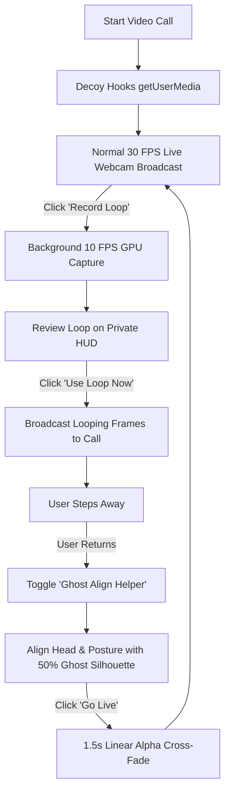
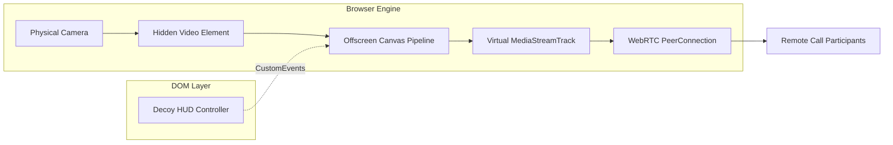

# decoy

In-browser WebRTC stream virtualization and camera transition controller for Google Meet and Zoom Web.

[](https://github.com/your-username/decoy)
[](LICENSE)
[](https://developer.chrome.com/docs/extensions/mv3/)
[](https://webrtc.org/)

`decoy` intercepts client-side `getUserMedia` streams and routes them through an offscreen canvas pipeline. This enables video looping, freezing, and posture-aligned cross-fading without kernel drivers, desktop background applications, or OS-level capture permissions.

---

## Star the Repository

If you find this project useful, please consider giving it a star on GitHub:

[](https://github.com/your-username/decoy)

---

## User Flow



---

## The Problem

Traditional virtual webcam tools (such as OBS Virtual Camera or `v4l2loopback`) operate at the OS driver level. They require:
- Kernel module compilation or system-wide software installation.
- Administrative/root permissions.
- Explicit display capture handling.

Additionally, returning from a paused or looped video feed creates an abrupt **jump-cut** due to minor shifts in body posture, head angle, and ambient lighting, which reveals that the feed was interrupted.

---

## How It Works



1. **WebRTC Stream Interception**: Hooks `navigator.mediaDevices.getUserMedia` before web applications initialize. Incoming camera constraints are captured, and the real hardware track is assigned to a hidden HTML `<video>` element.
2. **Virtual Stream Generation**: Video frames are processed onto an offscreen `<canvas>` element. The canvas stream is captured via `canvas.captureStream(30)` and returned to the calling application as a standard `MediaStream`.
3. **Throttled Texture Caching**: Loop recordings capture frames at 10 FPS as compressed GPU-backed `ImageBitmap` objects rather than raw byte arrays, capping memory usage under 45 MB for a 15-second buffer.
4. **Ghost Posture Alignment**: A private 50% opacity overlay of the reference frame is rendered in an isolated HUD panel, allowing the user to align physical posture before switching back.
5. **Linear Alpha Cross-Fade**: When returning to live video, the canvas performs a linear interpolation between the loop/freeze frame and the live camera feed over a configurable time window (default 1.5s):
   $$\text{Output}(t) = (1 - \alpha(t)) \cdot \text{Frame}_{\text{source}} + \alpha(t) \cdot \text{LiveFrame}(t)$$

---

## Installation & Quick Start

### 1. Clone the Repository

```bash
git clone https://github.com/your-username/decoy.git
cd decoy
```

### 2. Load the Extension in Chromium Browsers

1. Open **Google Chrome**, **Brave**, **Edge**, or **Arc**.
2. Navigate to the extensions page:
   ```
   chrome://extensions/
   ```
3. Enable **Developer mode** via the toggle in the top-right corner.
4. Click **Load unpacked** in the top-left toolbar.
5. Select the `decoy` repository folder.

### 3. Verification

1. Open any WebRTC meeting application:
   - [Google Meet](https://meet.google.com)
   - [Zoom Web](https://app.zoom.us/wc)
   - [WebRTC Sample Test](https://webrtc.github.io/samples/src/content/getusermedia/gum/)
2. Grant camera permissions when prompted.
3. The **Decoy Controller** HUD will appear floating in the bottom-right corner of the tab.

---

## Usage Guide

| Action | How To Execute | Behavior |
| :--- | :--- | :--- |
| **Freeze Frame** | Click `Freeze Frame` | Locks the current frame and broadcasts it as a static feed. |
| **Record Loop** | Set duration (seconds) & click `Record Loop` | Records a 10 FPS video buffer in the background while keeping the live feed active. |
| **Broadcast Loop** | Click `Use Loop Now` on the review dialog | Loops the recorded clip continuously to call participants. |
| **Ghost Alignment** | Check `Enable Ghost Align Helper` | Renders a 50% opacity silhouette on your private HUD to align posture. |
| **Smooth Go Live** | Click `Go Live` | Executes a linear alpha cross-fade back to live video over the configured duration. |

---

## System Architecture

```
+-----------------------------------------------------------------------+
|                         Main Page Context                             |
|                                                                       |
|   Web Application (Google Meet / Zoom Web)                            |
|         ^                                                             |
|         | (MediaStreamTrack)                                          |
|   navigator.mediaDevices.getUserMedia() [Intercepted]                 |
|         ^                                                             |
|         +-- canvas.captureStream(30)                                  |
|         |                                                             |
|   [Offscreen Canvas] <--- canvas-renderer.js                          |
|         ^                        ^                                    |
|         | (Raw Video)            | (State: LIVE, FREEZE, LOOP, FADE)  |
|   [Hidden Video Element]     inject.js                                |
+---------|------------------------|------------------------------------+
          | (DOM CustomEvents)     | (DOM CustomEvents)
+---------v------------------------v------------------------------------+
|                    Isolated Content Script World                      |
|                                                                       |
|   content.js ---> ui-builder.js ---> draggable.js                     |
|         |                                                             |
|         v                                                             |
|   Floating Control HUD (#webcam-control-container)                    |
+-----------------------------------------------------------------------+
```

---

## Technical Comparison

| Feature | decoy | OBS Virtual Camera | v4l2loopback |
| :--- | :--- | :--- | :--- |
| **Driver Dependency** | None (Pure JS) | Desktop App + Virtual Driver | Linux Kernel Module |
| **Platform Support** | Chrome / Brave / Edge / Arc | Windows / macOS / Linux | Linux Only |
| **Jump-Cut Mitigation** | Ghost Overlay + Alpha Fade | None (Hard Cut) | None |
| **HUD Privacy** | DOM Isolated (Invisible to Call) | Manual Scene Setup | N/A |
| **Memory Footprint** | < 45 MB | 300 MB - 1.2 GB | Variable |
| **Root Privileges** | Not Required | Installer Required | Required |

---

## Troubleshooting & FAQ

### Why does the HUD not appear on some websites?
Ensure the website requests the camera using `navigator.mediaDevices.getUserMedia({ video: true })`. Decoy activates when a video stream is requested.

### Is the HUD or Ghost Overlay visible to other meeting participants?
No. Decoy only sends raw pixels drawn to the offscreen `<canvas>` through `canvas.captureStream()`. The HUD, buttons, and ghost overlays exist purely in the webpage DOM, which the WebRTC stream cannot see.

### Does Decoy interfere with Content Security Policies (CSP)?
No. Decoy uses origin-safe DOM `CustomEvents` for IPC between the isolated content script and the page execution context, avoiding inline script evaluation.

---

## Project Structure

```
decoy/
├── manifest.json        # Extension Manifest V3 configuration
├── draggable.js         # Viewport-bounded pointer dragging logic
├── ui-builder.js        # DOM layout definition and element reference factory
├── content.js           # Content script orchestrator and IPC bridge
├── canvas-renderer.js   # Dual-canvas rendering routines and alpha-blending
├── inject.js            # getUserMedia hook, WebRTC pipeline, and FSM
├── styles.css           # HUD panel layout and transitions
└── index.html           # Documentation page and embed placeholder
```

---

## Development

```bash
# Clone repository
git clone https://github.com/your-username/decoy.git

# Serve documentation page locally
python3 -m http.server 8080
```

---

## License

MIT License. See [LICENSE](LICENSE) for details.
